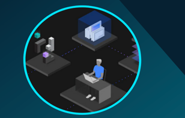

# Application Runtimes TechJam - Americas

**April 18 - April 20** 

**Application Runtimes Tech Jam Agenda**

  - This is a 3 day technical workshop.  
  - Refer to the daily agenda pages from the left-navigation section.
  
  

[Tech Jam Agenda](https://ibm.box.com/s/rg7azrhevx7th5kq94jfebruy2mwaw4l)

[Presentations](https://ibm.box.com/s/1y4zdw81v2ded2t87efrvx04efy09hou)

<!--
**Presentations**

[Presentation Material](https://ibm.box.com/v/FS2020-CP4Apps-Presentation)

**password:** fs2020ibm

-->

**Hands on Activities**

From the _navigation menu_, select the **Daily Agenda and Activities** item to view the daily agenda for this technical workshop. 

There, you will also find the links to the hands-on **lab guides** and information to accces the **VMware on IBM Cloud lab environments** 

